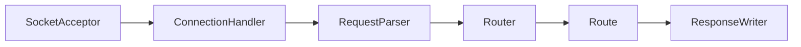

# Simple HTTP Server in Java
## Flowchart

# Technical Standards
- [RFC 9110: HTTP Semantics](https://datatracker.ietf.org/doc/html/rfc9110)
- [RFC 9112: HTTP/1.1](https://datatracker.ietf.org/doc/html/rfc9112)

# Tech Stack
- **Java** 21
- **Spring Boot** 3
- Logging: **SLF4J** API, **Logback** implementation
